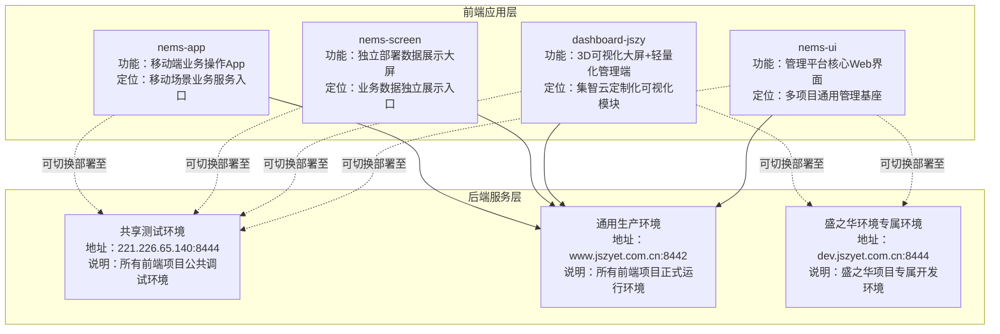

```mermaid
graph TB
subgraph 前端应用层
direction TB
UI[nems-ui<br/>功能：管理平台核心Web界面<br/>定位：多项目通用管理基座]
DASH[dashboard-jszy<br/>功能：3D可视化大屏+轻量化管理端<br/>定位：集智云定制化可视化模块]
SCREEN[nems-screen<br/>功能：独立部署数据展示大屏<br/>定位：业务数据独立展示入口]
APP[nems-app<br/>功能：移动端业务操作App<br/>定位：移动场景业务服务入口]
end
subgraph 后端服务层
direction TB
TEST[共享测试环境<br/>地址：221.226.65.140:8444<br/>说明：所有前端项目公共调试环境]
PROD[通用生产环境<br/>地址：www.jszyet.com.cn:8442<br/>说明：所有前端项目正式运行环境]
SZH[盛之华环境专属环境<br/>地址：dev.jszyet.com.cn:8444<br/>说明：盛之华项目专属开发环境]
end
%% 默认生产环境依赖关系
UI --> PROD
DASH --> PROD
SCREEN --> PROD
APP --> PROD
%% 所有项目可切换至共享测试环境
UI -. 可切换部署至 .-> TEST
DASH -. 可切换部署至 .-> TEST
SCREEN -. 可切换部署至 .-> TEST
APP -. 可切换部署至 .-> TEST
%% 核心项目可切换至盛之华专属开发环境
UI -. 可切换部署至 .-> SZH
DASH -. 可切换部署至 .-> SZH
```